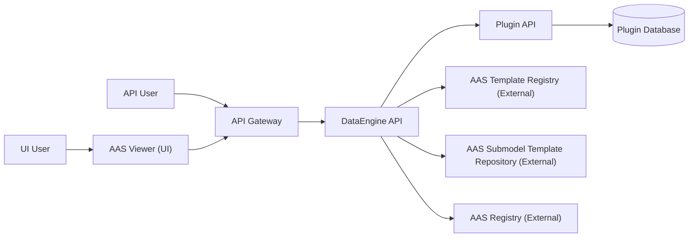

You are assisting on an open-source .NET API endpoint development project.
Default to changes that strengthen Onion Architecture, Clean Code, SOLID, security, and testability.

## Project Overview (Current Scope)

* **DataEngine**: A .NET API service aligned with **IDTA (Industrial Digital Twin Association) specifications** that dynamically generates Asset Administration Shell (AAS) structures (shell descriptors, submodels, and submodel elements).
  - On each request, DataEngine loads a template from external registries/repositories. At this time, templates contain only structure and semantic IDs; they do not contain values.
  - After DataEngine retrieves the template, it requests a plugin to provide the values needed to populate the template.
  - Once DataEngine receives the values from the plugin, it fills the template and returns a complete AAS model to the client.

### Plugin (General Concept)

A **Plugin** is a separate .NET API service that acts as the **data provider** for DataEngine.

Plugins are responsible for:

* Accessing/storing business data (database, files, or external systems).
* Resolving semantic IDs requested by DataEngine.
* Returning metadata and submodel data via JSON schema-based contracts or IDs.
* Exposing a Plugin Manifest that describes supported semantic IDs and capabilities.

### Registry & Repository (General Concept)

The AAS **registry** and **repository** services expose template and descriptor endpoints that DataEngine consumes to retrieve templates.

* These services are external platform dependencies.
* Registry/repository components are **not developed or maintained by this project**.

## High-Level Architecture

### Flow Summary

1. Clients (UI or API) send requests through the API Gateway to **DataEngine**.
2. DataEngine retrieves templates from external **AAS repositories/registries**.
3. Templates contain structure and semantic IDs but no values.
4. DataEngine requests semantic ID values from a **Plugin API** using a JSON schema structure.
5. Plugin resolves values from its database and returns them.
6. DataEngine populates the template and returns a complete AAS model to the client.

## Architecture (Onion / Clean Architecture)
- Maintain strict layer separation:
  - **DomainModel**: pure domain types only (no ASP.NET Core, no database/ADO.NET, no config/options, no logging).
  - **ApplicationLogic**: use cases, domain/application services, interfaces/ports; depends only on DomainModel.
  - **Infrastructure**: database, file system, external services; implements ApplicationLogic interfaces.
  - **Api**: HTTP/controllers/serialization; delegates to ApplicationLogic.
- Dependency direction: **Api** → **ApplicationLogic** → **DomainModel**; **Infrastructure** → **ApplicationLogic**.
- Never leak infrastructure/ASP.NET types into DomainModel/ApplicationLogic (e.g., `HttpContext`, `ControllerBase`, `DbConnection`, provider-specific types).
- Prefer defining ports (interfaces) in **ApplicationLogic** and implementing them in **Infrastructure**.

## API & DTOs
- Keep controllers thin: validation + request shaping + call handler/service + return mapped DTO.
- Do not return DomainModel types from controllers; always return DTOs under `Api/**/Responses`.
- Favor explicit request/response models over `JsonObject` when feasible; if dynamic JSON is required, isolate it to the API layer.
- Validation:
  - Validate route/query/body inputs consistently.
  - Keep validation rules close to request DTOs (or dedicated validators) and avoid duplication.

## Error Handling
- Use centralized exception handling via `ErrorController` (avoid scattered controller-level try/catch).
- Return stable JSON error contracts with correct HTTP status codes.
- Map **base exception types** in `ErrorController` (for example `NotFoundException`, `BadRequestException`, `ServiceUnavailableException`) rather than listing every custom exception.
- Ensure custom exceptions inherit from the correct base type and define safe, reusable default messages (`public const string DefaultMessage`).
- Keep exception messages human-readable, consistent in tone, and safe for external consumers (no stack traces, internal endpoint details, or sensitive data).
- Keep exception organization consistent:
  - `ApplicationLogic/Exceptions/Base`
  - `ApplicationLogic/Exceptions/Application`
  - `ApplicationLogic/Exceptions/Infrastructure`
- At boundaries, translate Infrastructure exceptions into Application exceptions before they reach the API. In some cases, the Infrastructure layer may directly throw application-level exceptions — especially if it has enough domain context to do so.

## Clean Code & SOLID
- Prefer small, cohesive classes and methods.
- Watch for SRP violations (especially “handler/service” classes growing too large): extract focused collaborators.
- Prefer descriptive names; avoid abbreviations unless well-known.
- Avoid duplicate logic; introduce shared helpers only if reuse is clear.
- Follow existing patterns in this repo:
  - `Api/**/Handler/*Handler.cs` orchestrates and delegates.
  - `ApplicationLogic/Services/**` contains business/use-case logic.
  - `Infrastructure/**` contains DB execution and provider implementations.

## Coding Patterns & Style (C#/.NET)
- Match existing repo conventions: file-scoped namespaces, implicit usings, nullable enabled, primary constructors where already used.
- Async/await:
  - Async methods must end with `Async`.
  - Accept `CancellationToken cancellationToken` as the last parameter for async methods and pass it through.
  - Use `ConfigureAwait(false)` in library-style code where the repo already does.
- Guard clauses:
  - Use `ArgumentNullException.ThrowIfNull` / `ArgumentException.ThrowIfNullOrWhiteSpace` consistently at boundaries.
  - Validate inputs at the API boundary (route/query/body) and again at service boundaries when needed.
- Exceptions:
  - Keep API mapping focused on base exception types; custom exceptions should inherit from the correct base.
  - Define safe reusable messages in custom exceptions (prefer `public const string DefaultMessage`).
  - Translate infrastructure exceptions at boundaries before returning to API consumers.
  - Do not leak raw/internal exception details to clients; return stable error contracts and log safely.
- Logging:
  - Use structured logging (`{PropertyName}`) and avoid logging secrets/connection strings/tokens.
  - Avoid logging decoded identifiers or payloads at `Information` unless explicitly required.
- Dependency Injection:
  - Depend on interfaces/ports from ApplicationLogic; implement them in Infrastructure.
  - Avoid static helpers for infrastructure concerns; prefer injectable collaborators.
- Formatting/readability:
  - Prefer small methods, avoid deep nesting; extract private helpers when logic branches.
  - Avoid `#region` in production code (acceptable in tests if it improves navigation).

## Testing & Quality
- Changes to business logic should be unit-testable without infrastructure.
- Add/update unit tests in the relevant test project for:
  - new mapping logic
  - exception mapping
  - validators and boundary conditions
- If changing architecture boundaries, ensure architecture tests remain valid.
- Prefer deterministic tests; avoid network/real DB in unit tests (use mocks).

## Unit Test Patterns (xUnit)
- Use Arrange / Act / Assert structure; keep each test focused on one behavior.
- Don't add comments in tests (especially for arrange, act, assert); use descriptive test method names to explain intent.
- Prefer meaningful SUT naming consistent with repo: `_sut` for system under test, `_logger` for logger substitutes, etc.
- Avoid asserting on implementation details when a behavioral assertion is available.
- Verify logging only when it is part of the behavior/contract.

### Unit Test Method Naming
Use one consistent pattern (choose the closest match to surrounding tests):
- Preferred: `{MethodUnderTest}_When{Condition}_{ReturnsOrThrows}{Expected}`
  - Example: `ExecuteQueryAsync_WhenNoRows_ThrowsResourceNotFoundException`
- Also acceptable (existing pattern): `{MethodUnderTest}_Should{Expectation}_When{Condition}`
  - Example: `DecodeBase64_ShouldThrow_OnNullOrWhitespace`
- For async tests, keep the `Async` suffix in the method under test portion of the name. 