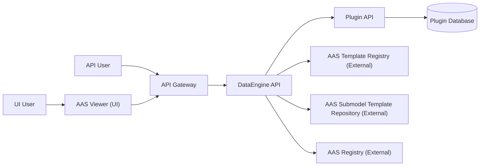

You are assisting on an open-source .NET API endpoint development project.
Default to changes that strengthen Onion Architecture, Clean Code, SOLID, security, and testability.

## Project Overview (Current Scope)

* **DataEngine**: A .NET API service aligned with **IDTA (Industrial Digital Twin Association) specifications** that dynamically generates Asset Administration Shell (AAS) structures (shell descriptors, submodels, and submodel elements).
  - On each request, DataEngine loads a template from external registries/repositories. At this time, templates contain only structure and semantic IDs; they do not contain values.
  - After DataEngine retrieves the template, it requests a plugin to provide the values needed to populate the template.
  - Once DataEngine receives the values from the plugin, it fills the template and returns a complete AAS model to the client.

### Plugin (General Concept)

A **Plugin** is a separate .NET API service that acts as the **data provider** for DataEngine.

Plugins are responsible for:

* Accessing/storing business data (database, files, or external systems).
* Resolving semantic IDs requested by DataEngine.
* Returning metadata and submodel data via JSON schema-based contracts or IDs.
* Exposing a Plugin Manifest that describes supported semantic IDs and capabilities.

### Registry & Repository (General Concept)

The AAS **registry** and **repository** services expose template and descriptor endpoints that DataEngine consumes to retrieve templates.

* These services are external platform dependencies.
* Registry/repository components are **not developed or maintained by this project**.

## High-Level Architecture

### Flow Summary

1. Clients (UI or API) send requests through the API Gateway to **DataEngine**.
2. DataEngine retrieves templates from external **AAS repositories/registries**.
3. Templates contain structure and semantic IDs but no values.
4. DataEngine requests semantic ID values from a **Plugin API** using a JSON schema structure.
5. Plugin resolves values from its database and returns them.
6. DataEngine populates the template and returns a complete AAS model to the client.
